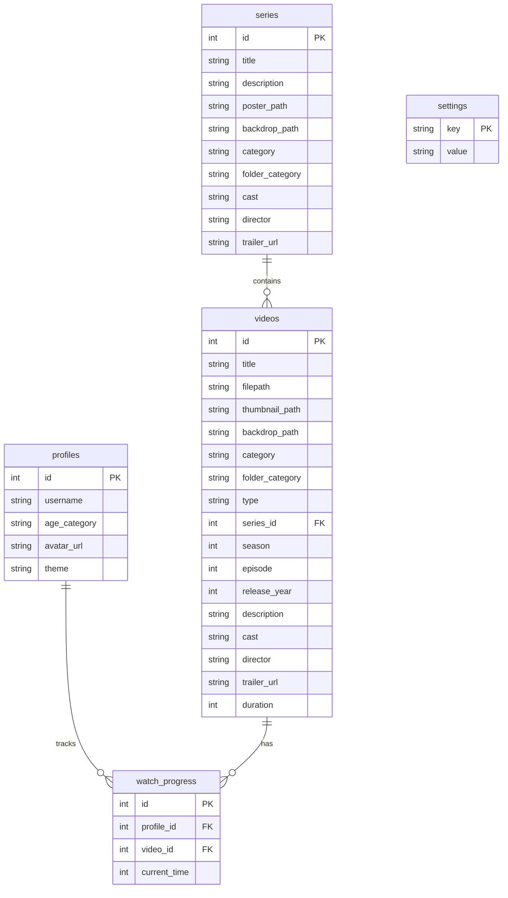

# StreamOS Development Guide

This guide provides a detailed overview of the StreamOS architecture, API, and development practices.

## 🏛️ Architecture Overview

StreamOS is built with a modern, decoupled architecture:
- **Frontend**: A Vue 3 application built with Vite, utilizing a "Liquid Glass" design aesthetic.
- **Backend**: A FastAPI (Python) server managing the media library, database, and streaming.
- **Database**: SQLite for lightweight, file-based data persistence.
- **Media Pipeline**: A custom indexing engine that scans your file system, parses metadata, and generates thumbnails using FFmpeg.

---

## 🛠️ Backend Development

### Project Structure
```bash
backend/
├── app/
│   ├── main.py        # FastAPI entry point & routes
│   ├── scanner.py     # Media indexing engine
│   ├── models.py      # SQLAlchemy database models
│   ├── crud.py        # Database operations (Create, Read, Update, Delete)
│   ├── schemas.py     # Pydantic models for API validation
│   ├── config.py      # System-wide configuration & constants
│   ├── tmdb.py        # TMDB API integration
│   └── utils.py       # Helper functions (FFmpeg, image processing)
├── media/             # Default media source (category-based folders)
├── thumbnails/        # Storage for generated assets
└── requirements.txt   # Python dependencies
```

### Media Indexing
StreamOS uses a path-based categorization system for age filtering:
1. `media/kids/` -> **Kids** category
2. `media/teen/` -> **Teen** category
3. `media/adult/` (or any other folder) -> **Adult** category

**Metadata Parsing Logic**:
- **Episodes**: Matches patterns like `S01E01`, `1x01`, or `Season 1 Episode 1`.
- **Movies**: Matches `Title (Year)`.
- **NFO Files**: Scans for `.nfo` files to extract rich metadata.
- **Local Artwork**: Prioritizes `poster.jpg`, `backdrop.jpg`, and folder-level artwork.

---

## 🎨 Frontend Development

### Tech Stack
- **Framework**: Vue 3 (Composition API)
- **Bundler**: Vite
- **Router**: Vue Router
- **Styling**: Vanilla CSS with a centralized `assets/styles.css` for design tokens.

### Design Principles: "Liquid Glass"
- **Glassmorphism**: 15px blurred backgrounds, subtle borders, and red/cyan glows.
- **Typography**: Inter (Modern, geometric sans-serif).
- **Interactive**: Scale-zooming profile icons and horizontal infinite-scrolling video rows.

---

## 🔌 API Documentation

The backend provides a RESTful API for all system operations.

### Profiles
- `GET /profiles`: List all user profiles.
- `GET /profile/{profile_id}`: Get details for a specific profile.
- `POST /profile/create`: Create a new profile (Name, Age Category, Theme, Avatar).
- `PATCH /profiles/{profile_id}`: Update an existing profile.
- `DELETE /profiles/{profile_id}`: Delete a profile and its history.

### Library & Media
- `GET /library?profile_id={id}`: Get the personalized library view for a profile (Movies, TV Shows, Anime, Continue Watching).
- `GET /series/{series_id}?profile_id={id}`: Get detailed series info and episode list.
- `GET /stream/{video_id}?profile_id={id}`: Stream a video file directly.
- `POST /scan`: Manually trigger a media library scan.
- `POST /scrape`: Manually trigger a TMDB metadata scrape.

### Progress Tracking
- `POST /progress`: Update the current watch position for a video.
- `GET /progress/{video_id}?profile_id={id}`: Retrieve current progress for a specific video.
- `GET /next-episode/{video_id}`: Get metadata for the next logical episode in a series.

### Thumbnails & Artwork
- `GET /thumbnail/{video_id}?profile_id={id}`: Fetch the poster/thumbnail for a video.
- `GET /thumbnail/series/{series_id}?profile_id={id}`: Fetch the series-level poster.
- `GET /thumbnail/backdrop/{video_id}?profile_id={id}`: Fetch the backdrop/fanart for a video.
- `GET /video/{video_id}/scrub/{timestamp}`: Fetch a preview thumbnail for a specific timestamp (Video Player Scrubbing).

---

## 📊 Database Schema

StreamOS uses a relational SQLite database. Below is the entity relationship diagram:



---

## ⚙️ Configuration

StreamOS can be configured via environment variables and the internal settings table.

### Environment Variables
| Variable | Description | Default |
|----------|-------------|---------|
| `TMDB_API_KEY` | API key for fetching metadata from TMDB. | `None` |
| `VITE_API_BASE` | (Frontend) The base URL of the FastAPI backend. | `http://localhost:8000` |

### Internal Settings (`settings` table)
| Key | Description |
|-----|-------------|
| `media_dir` | The root directory where media is stored. |
| `offline_mode` | If `true`, disables all external API calls (TMDB). |
| `tmdb_api_key` | Mirror of the environment variable, editable via UI. |

---

## 🚢 Production Deployment

For production environments, it is recommended to use a robust WSGI/ASGI server and a static file server.

### 1. Backend (Uvicorn + Gunicorn)
Run the backend with multiple workers for better performance:
```bash
cd backend
gunicorn -w 4 -k uvicorn.workers.UvicornWorker app.main:app --bind 0.0.0.0:8000
```

### 2. Frontend (Static Hosting)
Build the frontend and serve the `dist` folder using Nginx, Apache, or any static host:
```bash
cd streamos-ui
npm run build
```

### 3. Docker (Recommended)
The easiest way to deploy StreamOS is using Docker Compose:
```bash
docker-compose up -d --build
```
This will:
- Build and start the FastAPI backend.
- Build and start the Vue frontend (served by Nginx).
- Automatically proxy `/api/` requests from the frontend to the backend.
- Mount your `media/` and `thumbnails/` folders for persistence.

---

## 🛠️ Development Setup & Tasks

### Adding New Features
1. **Model Changes**: Update `models.py` and run migrations (if applicable).
2. **API Routes**: Add new endpoints in `main.py` using appropriate Pydantic schemas.
3. **UI Components**: Create or update Vue components in `streamos-ui/src/components`.

### Useful Commands
- **Regenerate Database**: Delete `backend/streamos.db` and restart the backend.
- **Clear Thumbnails**: Delete all folders inside `backend/thumbnails/` (except the directory itself).
- **Run Scan Manually**: Execute `python -m app.scanner` from the `backend/` directory.

### Dependency Management
- **Backend**: Add new packages to `backend/requirements.txt`.
- **Frontend**: Use `npm install` and ensure `package.json` is updated.
